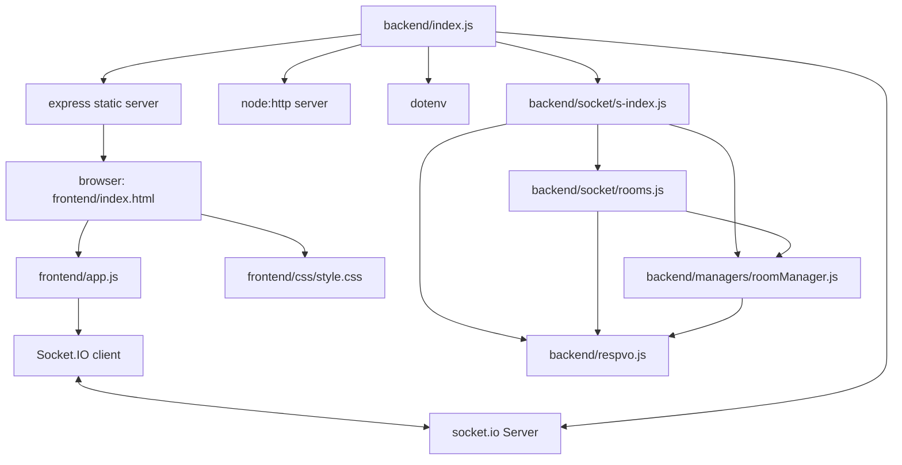
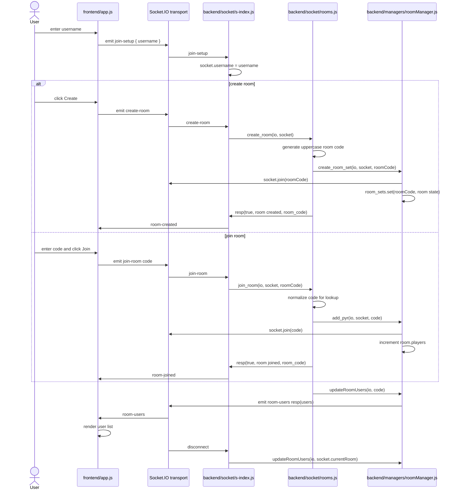
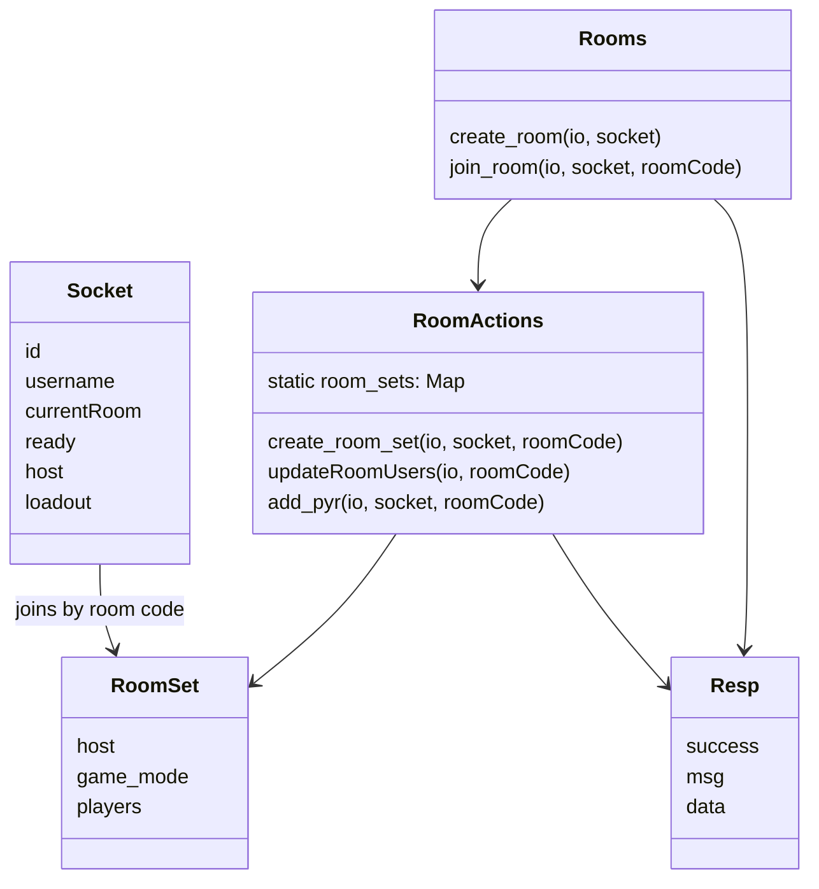
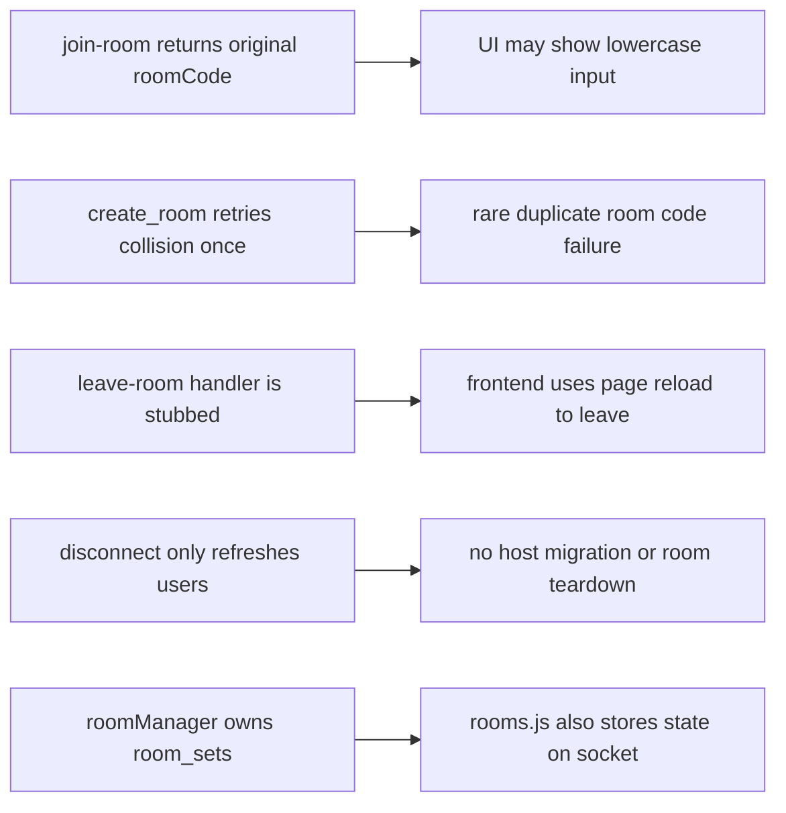

# Void Sector 108 Graph

## Module Dependency Graph

```mermaid
flowchart TD
  Browser["browser: frontend/index.html"]
  FrontendApp["frontend/app.js"]
  Style["frontend/css/style.css"]
  SocketClient["Socket.IO client"]

  BackendIndex["backend/index.js"]
  Express["express static server"]
  Http["node:http server"]
  Dotenv["dotenv"]
  SocketIoServer["socket.io Server"]
  SocketIndex["backend/socket/s-index.js"]
  Rooms["backend/socket/rooms.js"]
  RoomManager["backend/managers/roomManager.js"]
  Resp["backend/respvo.js"]

  Browser --> FrontendApp
  Browser --> Style
  FrontendApp --> SocketClient
  SocketClient <--> SocketIoServer

  BackendIndex --> Dotenv
  BackendIndex --> Express
  BackendIndex --> Http
  BackendIndex --> SocketIoServer
  BackendIndex --> SocketIndex
  Express --> Browser

  SocketIndex --> Rooms
  SocketIndex --> RoomManager
  SocketIndex --> Resp
  Rooms --> RoomManager
  Rooms --> Resp
  RoomManager --> Resp
```

## Runtime Room Lifecycle

```mermaid
sequenceDiagram
  actor User
  participant UI as frontend/app.js
  participant Socket as Socket.IO transport
  participant SIndex as backend/socket/s-index.js
  participant Rooms as backend/socket/rooms.js
  participant RM as backend/managers/roomManager.js

  User->>UI: enter username
  UI->>Socket: emit join-setup { username }
  Socket->>SIndex: join-setup
  SIndex->>SIndex: socket.username = username

  alt create room
    User->>UI: click Create
    UI->>Socket: emit create-room
    Socket->>SIndex: create-room
    SIndex->>Rooms: create_room(io, socket)
    Rooms->>Rooms: generate uppercase room code
    Rooms->>RM: create_room_set(io, socket, roomCode)
    RM->>Socket: socket.join(roomCode)
    RM->>RM: room_sets.set(roomCode, room state)
    Rooms->>SIndex: resp(true, room created, room_code)
    SIndex->>UI: room-created
  else join room
    User->>UI: enter code and click Join
    UI->>Socket: emit join-room code
    Socket->>SIndex: join-room
    SIndex->>Rooms: join_room(io, socket, roomCode)
    Rooms->>Rooms: normalize code for lookup
    Rooms->>RM: add_pyr(io, socket, code)
    RM->>Socket: socket.join(code)
    RM->>RM: increment room.players
    Rooms->>SIndex: resp(true, room joined, room_code)
    SIndex->>UI: room-joined
  end

  Rooms->>RM: updateRoomUsers(io, code)
  RM->>Socket: emit room-users resp(users)
  Socket->>UI: room-users
  UI->>UI: render user list

  Socket->>SIndex: disconnect
  SIndex->>RM: updateRoomUsers(io, socket.currentRoom)
```

## Room State Shape

```mermaid
classDiagram
  class Socket {
    id
    username
    currentRoom
    ready
    host
    loadout
  }

  class Resp {
    success
    msg
    data
  }

  class RoomSet {
    host
    game_mode
    players
  }

  class RoomActions {
    static room_sets: Map
    create_room_set(io, socket, roomCode)
    updateRoomUsers(io, roomCode)
    add_pyr(io, socket, roomCode)
  }

  class Rooms {
    create_room(io, socket)
    join_room(io, socket, roomCode)
  }

  RoomActions --> RoomSet
  RoomActions --> Resp
  Rooms --> RoomActions
  Rooms --> Resp
  Socket --> RoomSet : joins by room code
```

## Current Hotspots

```mermaid
flowchart LR
  LowercaseJoin["join-room returns original roomCode"] --> DisplayMismatch["UI may show lowercase input"]
  SingleRetry["create_room retries collision once"] --> CollisionRisk["rare duplicate room code failure"]
  LeaveStub["leave-room handler is stubbed"] --> ReloadLeave["frontend uses page reload to leave"]
  DisconnectOnlyRefresh["disconnect only refreshes users"] --> HostGap["no host migration or room teardown"]
  RoomManagerDraft["roomManager owns room_sets"] --> SocketState["rooms.js also stores state on socket"]
```
