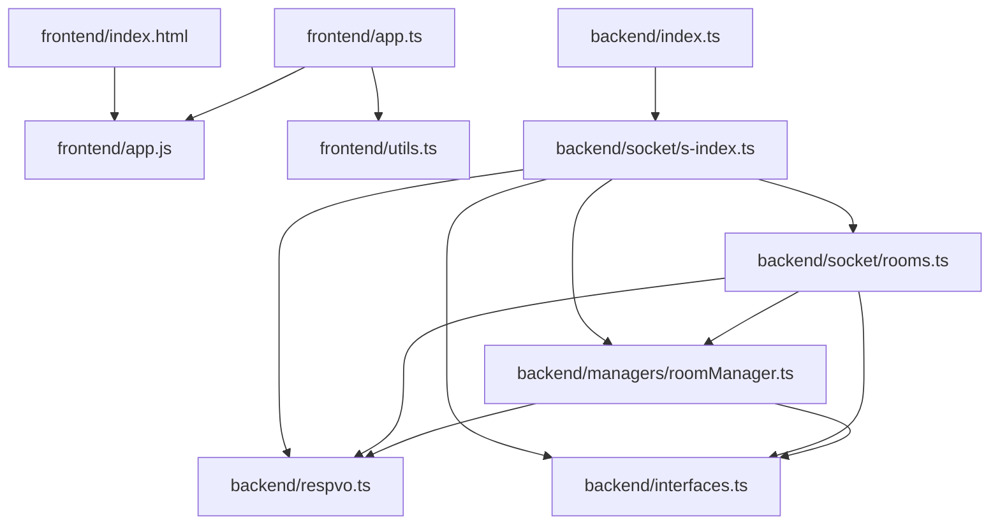
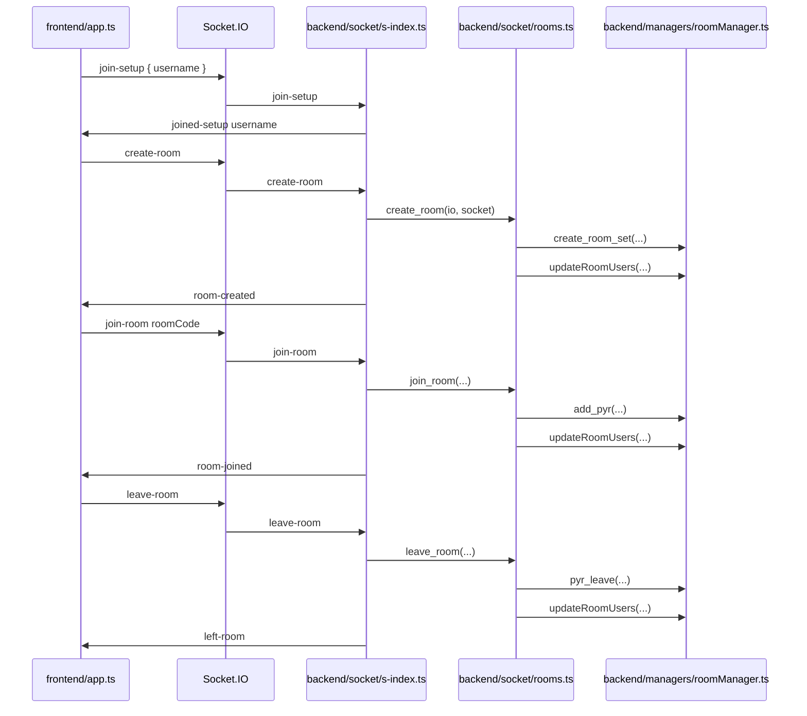

# Void Sector 108 Graph

Generated from project source notes.

## Module Dependency Graph

## Socket Flow

## Source Files

- `backend/index.ts`
- `backend/socket/s-index.ts`
- `backend/socket/rooms.ts`
- `backend/managers/roomManager.ts`
- `backend/respvo.ts`
- `backend/interfaces.ts`
- `frontend/index.html`
- `frontend/app.ts`
- `frontend/utils.ts`
